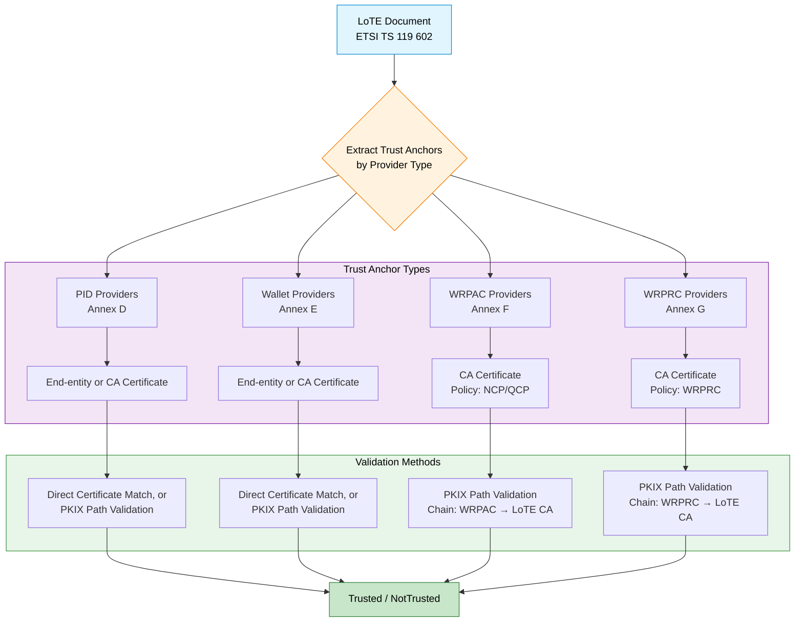

# 119602 Consultation Module

The EUDI ETSI TS 119 602 Consultation module provides abstractions and implementations for validating certificate chains
against trust anchors published in **ETSI TS 119 602 Lists of Trusted Entities (LoTE)**.

This module enables Wallets, Issuers, and Verifiers to verify the trustworthiness of credentials (PIDs, EAAs) and
attestation objects by navigating trust trees defined in LoTE format, as specified by ETSI TS 119 602. The module
enforces certificate constraints per ETSI TS 119 412-6 (PID/Wallet), ETSI TS 119 411-8 (WRPAC), and ETSI TS 119 475 (
WRPRC).

---

## Purpose

The module automates the process of:

- Fetching and parsing ETSI TS 119 602 LoTE documents
- Extracting trust anchors from LoTE entries
- Validating certificate chains against LoTE-derived trust anchors
- Enforcing certificate constraints per ETSI specifications

---

## Specification Framework

This module implements certificate validation according to the following ETSI specification framework:

### Core LoTE Specification

- **ETSI TS 119 602**: Defines Lists of Trusted Entities (LoTE) data model and structure
    - Annex D: EU PID Providers List profile
    - Annex E: EU Wallet Providers List profile
    - Annex F: EU WRPAC Providers List profile
    - Annex G: EU WRPRC Providers List profile

### Certificate Profile Specifications

- **ETSI TS 119 412-6**: Certificate profiles for PID and Wallet providers (end-entity certificates with QCStatements)
- **ETSI TS 119 411-8**: Certificate policy for WRPAC (Wallet Relying Party Access Certificates) providers
- **ETSI TS 119 475**: WRPRC (Wallet Relying Party Registration Certificate) format and policy requirements

### Supporting Specifications

- **EN 319 412-2**: Certificate profiles for natural persons
- **EN 319 412-3**: Certificate profiles for legal persons
- **EN 319 412-5**: QCStatements specification
- **ETSI TS 119 612**: Trusted Lists (general framework)

---

## Quick Start

### 1. Add dependency

Add the following to your `build.gradle.kts`:

```kotlin
dependencies {
    // Replace $version with the latest release version
    // All modules share the same same version number
    implementation("eu.europa.ec.eudi:etsi-119602-consultation:$version")
}
```

> [!NOTE]
> Replace `$version` with the latest release version from
> the [releases page](https://github.com/eu-digital-identity-wallet/eudi-lib-kmp-etsi-1196x2/releases).

### 2. Configure and use ProvisionTrustAnchorsFromLoTEs

```kotlin
import eu.europa.ec.eudi.etsi119602.consultation.*
import eu.europa.ec.eudi.etsi119602.consultation.eu.*
import eu.europa.ec.eudi.etsi1196x2.consultation.*
import eu.europa.ec.eudi.etsi1196x2.consultation.VerificationContext
import io.ktor.client.*
import io.ktor.client.engine.java.*
import kotlinx.coroutines.*
import kotlinx.io.files.Path
import java.security.cert.TrustAnchor
import java.security.cert.X509Certificate
import kotlin.time.Duration.Companion.hours
import kotlin.time.Duration.Companion.minutes

// 1. Setup HTTP client and file cache
val httpClient = HttpClient(Java)
val fileStore = LoTEFileStore(
    cacheDirectory = Path(System.getProperty("java.io.tmpdir")!!, "lote-cache")
)
val loadLoTE = LoadSingleLoTEWithFileCache(
    fileStore = fileStore,
    downloadSingleLoTE = DownloadSingleLoTE(httpClient),
    fileCacheExpiration = 24.hours
)

// 2. Configure LoTE locations and service types
val loteLocations = SupportedLists(
    pidProviders = "https://example.com/pid-providers.json",
    walletProviders = "https://example.com/wallet-providers.json"
)

// 3. Create the main entry point
val provisionTrustAnchors = ProvisionTrustAnchorsFromLoTEs.eudiwJvm(loadLoTEAndPointers = loadLoTE)

// 4a. Use nonCached() for simple/low-concurrency scenarios
val isChainTrustedForContext = provisionTrustAnchors.nonCached(loteLocations)

// 4b. Use cached() for high-concurrency scenarios (e.g., server-side)
useResources { scope ->
    val cachedValidator = provisionTrustAnchors.cached(
        disposableScope = scope,
        loteLocationsSupported = loteLocations,
        ttl = 10.minutes
    )
    // Use cachedValidator for concurrent requests
}
```

### 3. Validate certificate chains

```kotlin
import kotlinx.coroutines.runBlocking

runBlocking {
    // Using nonCached validator
    val result = isChainTrustedForContext(certificateChain, VerificationContext.PID)
    println("Trusted: ${result.isTrusted()}")
    
    // Or using cached validator
    useResources {
        //..
        val cachedResult = cachedValidator(certificateChain, VerificationContext.PID)
        println("Trusted (cached): ${cachedResult.isTrusted()}")
    }  
}
```

---

## Core Abstractions

The module provides the following key abstractions for working with ETSI TS 119 602 LoTE documents:

🔍 **LoTE Discovery & Loading**

- `ProvisionTrustAnchorsFromLoTEs`: **Main entry point** - High-level factory for provisioning trust anchors from LoTEs with built-in caching support (`cached()` for high-concurrency, `nonCached()` for simple scenarios)
- `LoadLoTEAndPointers`: Loads LoTE documents and follows pointers to related lists with configurable depth limits
- `LoadSingleLoTEWithFileCache`: File-cached implementation combining `DownloadSingleLoTE` with persistent storage
- `DownloadSingleLoTE`: HTTP client-based loader for fetching single LoTE documents
- `GetTrustAnchorsFromLoTE`: Low-level extractor for trust anchors from LoTE documents (used internally by `ProvisionTrustAnchorsFromLoTEs`)

🛡️ **LoTE Profiles**

Predefined profiles for EU LoTE types, enforcing certificate constraints per ETSI specifications:

- `EUPIDProvidersList`: PID Provider profile (ETSI TS 119 602 Annex D)
- `EUWalletProvidersList`: Wallet Provider profile (ETSI TS 119 602 Annex E)
- `EUWRPACProvidersList`: WRPAC Provider profile (ETSI TS 119 602 Annex F)
- `EUWRPRCProvidersList`: WRPRC Provider profile (ETSI TS 119 602 Annex G)

---

## Architecture Overview



The validation flow follows four distinct paths based on provider type:

| Provider             | LoTE Annex | Trust Anchor                 | Validation Method    | Specification     |
|----------------------|------------|------------------------------|----------------------|-------------------|
| **PID Providers**    | Annex D    | End-entity or CA Certificate | Direct Trust or PKIX | ETSI TS 119 412-6 |
| **Wallet Providers** | Annex E    | End-entity or CA certificate | Direct Trust or PKIX | ETSI TS 119 412-6 |
| **WRPAC Providers**  | Annex F    | CA certificate               | PKIX                 | ETSI TS 119 411-8 |
| **WRPRC Providers**  | Annex G    | CA certificate               | PKIX                 | ETSI TS 119 475   |

---

## Platform Support

The 119602-consultation module is a **Kotlin Multiplatform (KMP)** module.

- **commonMain**: Core logic and abstractions.
- **jvmAndAndroidMain**: Specific implementations for JVM and Android.

---

## Dependencies

### Required

```kotlin
dependencies {
    // Core consultation abstractions
    api("eu.europa.ec.eudi:etsi-1196x2-consultation:$version")
    
    // LoTE data model (transitive via api dependency)
    api("eu.europa.ec.eudi:etsi-119602-data-model:$version")
    
    // Ktor client for HTTP operations
    api("io.ktor:ktor-client-core:$ktorVersion")
    
    // Kotlinx IO for file operations
    implementation("org.jetbrains.kotlinx:kotlinx-io-core:$kotlinxIoVersion")
    
    // AtomicFU for atomic operations (transitive)
    implementation("org.jetbrains.kotlinx:atomicfu:$atomicfuVersion")
}
```

### JVM/Android Specific

```kotlin
dependencies {
    // Bouncy Castle for cryptographic operations
    implementation("org.bouncycastle:bcprov-jdk18on:$bouncyCastleVersion")
}
```

### Transitive Dependencies

- `kotlinx-serialization-json` (via `etsi-119602-data-model`)
- `kotlinx-coroutines-core` (for suspend functions)
- `atomicfu` (for thread-safe operations)

---

## References

### Core Specifications

- [ETSI TS 119 602 - Lists of Trusted Entities (LoTE)](https://www.etsi.org/deliver/etsi_ts/119600_119699/119602/)
- [ETSI TS 119 612 - Trusted Lists](https://www.etsi.org/deliver/etsi_ts/119600_119699/119612/)

### Certificate Profile Specifications

- [ETSI TS 119 412-6 - Certificate profiles for PID, Wallet, EAA providers](https://www.etsi.org/deliver/etsi_ts/119400_119499/11941206/)
- [ETSI TS 119 411-8 - WRPAC Certificate Policy](https://www.etsi.org/deliver/etsi_ts/119400_119499/11941108/)
- [ETSI TS 119 475 - WRPRC Specification](https://www.etsi.org/deliver/etsi_ts/119400_119499/119475/)

### Supporting Specifications

- [EN 319 412-2 - Certificates issued to natural persons](https://www.etsi.org/deliver/etsi_en/319400_319499/31941202/)
- [EN 319 412-3 - Certificates issued to legal persons](https://www.etsi.org/deliver/etsi_en/319400_319499/31941203/)
- [EN 319 412-5 - QCStatements](https://www.etsi.org/deliver/etsi_en/319400_319499/31941205/)

### Implementation Guidance

- [EUDI Wallet Reference Implementation](https://github.com/eu-digital-identity-wallet/.github/blob/main/profile/reference-implementation.md)
- [LoTE Certificate Validation Analysis](../docs/LoTE-Certificate-Validation.md)

---

## See Also

- **[Root README](../README.md)** - Project overview and installation
- **[Consultation Module](../consultation/README.md)** - Core abstractions for certificate chain validation
- **[Consultation-DSS Module](../consultation-dss/README.md)** - ETSI Trusted Lists support via DSS
- **[119602-data-model Module](../119602-data-model/README.md)** - ETSI TS 119 602 LoTE JSON data model

---

## License

Copyright (c) 2026 European Commission

Licensed under the Apache License, Version 2.0 (the "License");
you may not use this file except in compliance with the License.
You may obtain a copy of the License at

    http://www.apache.org/licenses/LICENSE-2.0

Unless required by applicable law or agreed to in writing, software
distributed under the License is distributed on an "AS IS" BASIS,
WITHOUT WARRANTIES OR CONDITIONS OF ANY KIND, either express or implied.
See the License for the specific language governing permissions and
limitations under the License.
