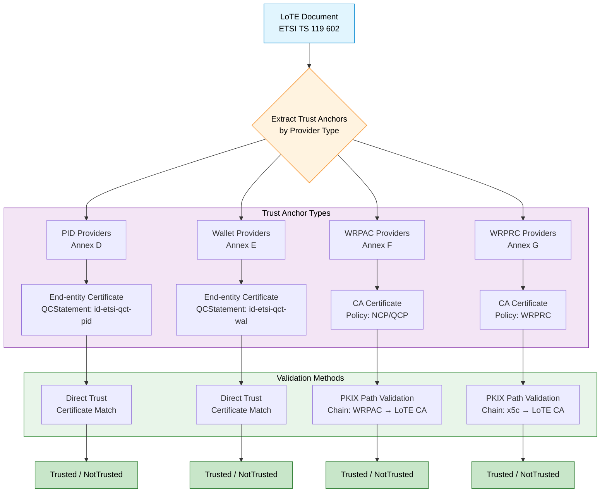

# 119602 Consultation Module

The EUDI ETSI TS 119 602 Consultation module provides abstractions and implementations for validating certificate chains
against trust anchors published in **ETSI TS 119 602 Lists of Trusted Entities (LoTE)**.

This module enables Wallets, Issuers, and Verifiers to verify the trustworthiness of credentials (PIDs, EAAs) and
attestation objects by navigating trust trees defined in LoTE format, as specified by ETSI TS 119 602. The module
enforces certificate constraints per ETSI TS 119 412-6 (PID/Wallet), ETSI TS 119 411-8 (WRPAC), and ETSI TS 119 475 (
WRPRC).

> [!WARNING]
> **Status: Under Development** - This module is currently being developed. API and features may change.

---

## Purpose

The module automates the process of:

- Fetching and parsing ETSI TS 119 602 LoTE documents
- Extracting trust anchors from LoTE entries
- Validating certificate chains against LoTE-derived trust anchors
- Enforcing certificate constraints per ETSI specifications

### Certificate Constraint Enforcement

The module enforces provider-specific certificate constraints according to the following ETSI specifications:

| Provider Type        | Specification     | Certificate Type | Key Constraints                                                                                    | Validation Method |
|----------------------|-------------------|------------------|----------------------------------------------------------------------------------------------------|-------------------|
| **PID Providers**    | ETSI TS 119 412-6 | End-entity       | QCStatement (id-etsi-qct-pid), digitalSignature, Certificate Policy (presence), AIA (if CA-issued) | Direct Trust      |
| **Wallet Providers** | ETSI TS 119 412-6 | End-entity       | QCStatement (id-etsi-qct-wal), digitalSignature, Certificate Policy (presence), AIA (if CA-issued) | Direct Trust      |
| **WRPAC Providers**  | ETSI TS 119 411-8 | CA               | keyCertSign, policy OID (NCP-n/NCP-l/QCP-n/QCP-l)                                                  | PKIX              |
| **WRPRC Providers**  | ETSI TS 119 475   | CA               | keyCertSign, policy OID (wrprc)                                                                    | PKIX              |

**Note on Certificate Policy for PID/Wallet Providers:** Per EN 319 412-2 §4.3.3, the certificatePolicies extension
shall be present. The specific policy OIDs are TSP-defined (not mandated by ETSI TS 119 412-6). The validator checks for
the presence of the certificatePolicies extension but does not validate specific OID values.

---

## Specification Framework

This module implements certificate validation according to the following ETSI specification framework:

### Core LoTE Specification

- **ETSI TS 119 602**: Defines Lists of Trusted Entities (LoTE) data model and structure
    - Annex D: EU PID Providers List profile
    - Annex E: EU Wallet Providers List profile
    - Annex F: EU WRPAC Providers List profile
    - Annex G: EU WRPRC Providers List profile

### Certificate Profile Specifications

- **ETSI TS 119 412-6**: Certificate profiles for PID and Wallet providers (end-entity certificates with QCStatements)
- **ETSI TS 119 411-8**: Certificate policy for WRPAC (Wallet Relying Party Access Certificates) providers
- **ETSI TS 119 475**: WRPRC (Wallet Relying Party Registration Certificate) format and policy requirements

### Supporting Specifications

- **EN 319 412-2**: Certificate profiles for natural persons
- **EN 319 412-3**: Certificate profiles for legal persons
- **EN 319 412-5**: QCStatements specification
- **ETSI TS 119 612**: Trusted Lists (general framework)

---

## Quick Start

> [!NOTE]
> API and usage examples will be added once the module implementation is complete.

```kotlin
// TBD - API under development
```

---

## Core Abstractions

> [!NOTE]
> Detailed documentation of core abstractions will be added once the module implementation is complete.

Planned abstractions include:

🔍 **LoTE Discovery**

- `LoadLoTE`: Fetching and parsing LoTE documents
- `GetTrustAnchorsFromLoTE`: Extracting trust anchors from LoTE entries

🛡️ **Validation**

- Integration with `ValidateCertificateChainUsingPKIX` and `ValidateCertificateChainUsingDirectTrust` from the
  consultation module

📋 **Certificate Constraints**

- `PidWalletCertificateConstraint`: Validates PID/Wallet provider certificates per ETSI TS 119 412-6
    - QCStatement presence (id-etsi-qct-pid or id-etsi-qct-wal)
    - Key usage (digitalSignature)
    - End-entity certificate (basicConstraints: cA=FALSE)
    - **Certificate policy extension present** (per EN 319 412-2 §4.3.3, TSP-defined OID)
    - AIA extension (if CA-issued)

- `WrpacCertificateConstraint`: Validates WRPAC provider certificates per ETSI TS 119 411-8
    - CA certificate (basicConstraints: cA=TRUE)
    - Key usage (keyCertSign)
    - Certificate policy OID (NCP-n-eudiwrp, NCP-l-eudiwrp, QCP-n-eudiwrp, QCP-l-eudiwrp)

- `WrprcCertificateConstraint`: Validates WRPRC provider certificates per ETSI TS 119 475
    - CA certificate (basicConstraints: cA=TRUE)
    - Key usage (keyCertSign)
    - Certificate policy OID (wrprc)

---

## Validation Methods

The module implements two validation methods per ETSI TS 119 602:

### Direct Trust Validation

Used for **PID Providers** and **Wallet Providers**:

- LoTE contains end-entity signing certificates
- Validation: Direct certificate matching (subject + serial)
- Specification: ETSI TS 119 602 Annex D (PID), Annex E (Wallet)

**Validation Steps:**

1. Extract the first certificate from JWT `x5c` header
2. Load trust anchors from LoTE ServiceDigitalIdentity
3. Match certificate by subject name and serial number
4. Verify validity period (notBefore, notAfter)
5. Verify QCStatement (id-etsi-qct-pid or id-etsi-qct-wal)
6. **Verify certificatePolicies extension is present** (per EN 319 412-2 §4.3.3)
7. Verify revocation status (if CRL/OCSP available)
8. Verify key usage (digitalSignature bit)

### PKIX Path Validation

Used for **WRPAC Providers** and **WRPRC Providers**:

- LoTE contains CA certificates (trust anchors)
- Validation: Build certification path from end-entity to LoTE CA
- Specification: ETSI TS 119 602 Annex F (WRPAC), Annex G (WRPRC)

**Validation Steps (WRPAC):**

1. Extract the certificate chain from JWT `x5c` header
2. Load trust anchors from LoTE ServiceDigitalIdentity
3. Verify LoTE certificates are CA certificates (basicConstraints: cA=TRUE)
4. Verify `x5c` contains end-entity certificate (basicConstraints: cA=FALSE)
5. Build certification path from WRPAC (x5c) to LoTE trust anchor
6. Verify signature on each certificate in the path
7. Verify basicConstraints (cA=TRUE for intermediates)
8. Verify pathLenConstraint
9. Verify validity periods
10. Check revocation (CRL/OCSP)
11. Verify key usage (keyCertSign for CA, digitalSignature for end-entity)

**Validation Steps (WRPRC):**

1. Extract `x5c` certificate chain from WRPRC JWT header
2. Load trust anchors from LoTE ServiceDigitalIdentity
3. Verify LoTE certificates are CA certificates (basicConstraints: cA=TRUE)
4. Build certification path from WRPRC signing certificate to LoTE trust anchor
5. Verify signature on each certificate in the path
6. Verify basicConstraints (cA=TRUE for intermediates)
7. Verify pathLenConstraint
8. Verify validity periods
9. Check revocation (CRL/OCSP)
10. Verify key usage (keyCertSign for CA, digitalSignature for end-entity)

---

## Architecture Overview



The validation flow follows four distinct paths based on provider type:

| Provider             | LoTE Annex | Trust Anchor           | Validation Method | Specification     |
|----------------------|------------|------------------------|-------------------|-------------------|
| **PID Providers**    | Annex D    | End-entity certificate | Direct Trust      | ETSI TS 119 412-6 |
| **Wallet Providers** | Annex E    | End-entity certificate | Direct Trust      | ETSI TS 119 412-6 |
| **WRPAC Providers**  | Annex F    | CA certificate         | PKIX              | ETSI TS 119 411-8 |
| **WRPRC Providers**  | Annex G    | CA certificate         | PKIX              | ETSI TS 119 475   |

---

## Platform Support

The 119602-consultation module is a **Kotlin Multiplatform (KMP)** module.

- **commonMain**: Core logic and abstractions.
- **jvmAndAndroidMain**: Specific implementations for JVM and Android.

---

## Dependencies

> [!NOTE]
> Dependencies will be documented once the module implementation is complete.

Expected dependencies:

- `eu.europa.ec.eudi:etsi-1196x2-consultation` (core consultation module)
- `eu.europa.ec.eudi:etsi-119602-data-model` (LoTE data model)
- kotlinx.serialization (JSON parsing)

---

## References

### Core Specifications

- [ETSI TS 119 602 - Lists of Trusted Entities (LoTE)](https://www.etsi.org/deliver/etsi_ts/119600_119699/119602/)
- [ETSI TS 119 612 - Trusted Lists](https://www.etsi.org/deliver/etsi_ts/119600_119699/119612/)

### Certificate Profile Specifications

- [ETSI TS 119 412-6 - Certificate profiles for PID, Wallet, EAA providers](https://www.etsi.org/deliver/etsi_ts/119400_119499/11941206/)
- [ETSI TS 119 411-8 - WRPAC Certificate Policy](https://www.etsi.org/deliver/etsi_ts/119400_119499/11941108/)
- [ETSI TS 119 475 - WRPRC Specification](https://www.etsi.org/deliver/etsi_ts/119400_119499/119475/)

### Supporting Specifications

- [EN 319 412-2 - Certificates issued to natural persons](https://www.etsi.org/deliver/etsi_en/319400_319499/31941202/)
- [EN 319 412-3 - Certificates issued to legal persons](https://www.etsi.org/deliver/etsi_en/319400_319499/31941203/)
- [EN 319 412-5 - QCStatements](https://www.etsi.org/deliver/etsi_en/319400_319499/31941205/)

### Implementation Guidance

- [EUDI Wallet Reference Implementation](https://github.com/eu-digital-identity-wallet/.github/blob/main/profile/reference-implementation.md)
- [LoTE Certificate Validation Analysis](../docs/LoTE-Certificate-Validation.md)

---

## See Also

- **[Root README](../README.md)** - Project overview and installation
- **[Consultation Module](../consultation/README.md)** - Core abstractions for certificate chain validation
- **[Consultation-DSS Module](../consultation-dss/README.md)** - ETSI Trusted Lists support via DSS
- **[119602-data-model Module](../119602-data-model/README.md)** - ETSI TS 119 602 LoTE JSON data model

---

## License

Copyright (c) 2026 European Commission

Licensed under the Apache License, Version 2.0 (the "License");
you may not use this file except in compliance with the License.
You may obtain a copy of the License at

    http://www.apache.org/licenses/LICENSE-2.0

Unless required by applicable law or agreed to in writing, software
distributed under the License is distributed on an "AS IS" BASIS,
WITHOUT WARRANTIES OR CONDITIONS OF ANY KIND, either express or implied.
See the License for the specific language governing permissions and
limitations under the License.
