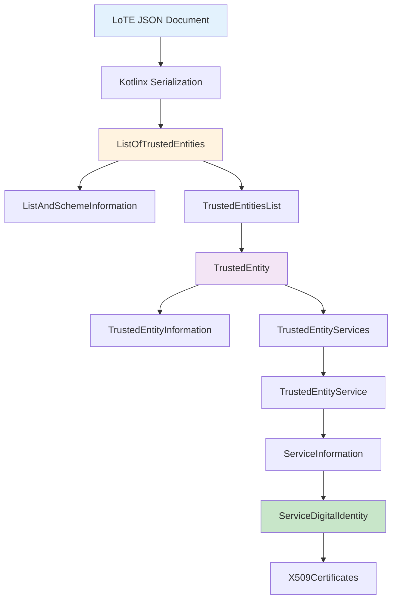
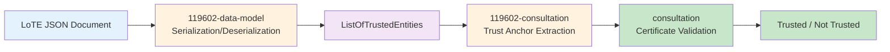

# 119602 Data Model Module

The EUDI ETSI TS 119 602 Data Model module provides a **Kotlinx serialization** implementation of the data structures defined in [ETSI TS 119 602 - Lists of Trusted Entities (LoTE)](https://www.etsi.org/deliver/etsi_ts/119600_119699/119602/).

This module enables serialization and deserialization of LoTE documents to/from JSON format, ensuring compliance with the ETSI TS 119 602 JSON schema.

---

## Quick Start

### 1. Add dependency

Add the following to your `build.gradle.kts`:

```kotlin
dependencies {
    implementation("eu.europa.ec.eudi:etsi-119602-data-model:$version")
}
```

### 2. Deserialize a LoTE document

```kotlin
import eu.europa.ec.eudi.etsi119602.ListOfTrustedEntities
import kotlinx.serialization.json.Json

val json = """
{
  "ListAndSchemeInformation": {
    "LoTEVersionIdentifier": "1.1.1",
    "LoTESequenceNumber": 1,
    "LoTEType": "http://uri.etsi.org/19602/LoTEType",
    "SchemeOperatorName": [{"lang": "en", "value": "Example Operator"}],
    "SchemeName": [{"lang": "en", "value": "Example Scheme"}],
    "SchemeInformationURI": [{"lang": "en", "uriValue": "https://example.com/scheme"}],
    "StatusDeterminationApproach": "http://uri.etsi.org/19602/StatusDetn/EU",
    "SchemeTypeCommunityRules": ["http://uri.etsi.org/19602/schemerules/EU"],
    "SchemeTerritory": "EU",
    "ListIssueDateTime": "2024-01-01T00:00:00Z",
    "NextUpdate": {"dateTime": "2025-01-01T00:00:00Z"}
  },
  "TrustedEntitiesList": [
    {
      "TrustedEntityInformation": {
        "TEName": [{"lang": "en", "value": "Example Provider"}],
        "TEAddress": {
          "TEPostalAddress": [{"lang": "en", "StreetAddress": "Example St", "Locality": "Brussels", "Country": "BE"}],
          "TEElectronicAddress": [{"lang": "en", "uriValue": "https://example.com"}]
        },
        "TEInformationURI": [{"lang": "en", "uriValue": "https://example.com/info"}]
      },
      "TrustedEntityServices": [
        {
          "ServiceInformation": {
            "ServiceName": [{"lang": "en", "value": "PID Issuance"}],
            "ServiceDigitalIdentity": {
              "X509Certificates": [{"encoding": "base64", "val": "MIID..."}]
            },
            "ServiceTypeIdentifier": "http://uri.etsi.org/19602/SvcType/PID/Issuance",
            "ServiceStatus": "http://uri.etsi.org/19602/Status/granted"
          }
        }
      ]
    }
  ]
}
""".trimIndent()

val jsonFormat = Json { ignoreUnknownKeys = true }
val lote = jsonFormat.decodeFromString<ListOfTrustedEntities>(json)

// Access LoTE data
println("LoTE Version: ${lote.schemeInformation.loteVersionIdentifier}")
println("Trusted Entities: ${lote.entities?.size}")
```

### 3. Serialize a LoTE document

```kotlin
import eu.europa.ec.eudi.etsi119602.*
import kotlinx.serialization.json.Json

// Create LoTE structure
val schemeInfo = ListAndSchemeInformation(
    loteVersionIdentifier = ETSI19602.LOTE_VERSION,
    loteSequenceNumber = ETSI19602.INITIAL_SEQUENCE_NUMBER,
    loteType = URI(ETSI19602.LOTE_TYPE_URI),
    schemeOperatorName = listOf(MultilanguageString("en", "Example Operator")),
    schemeName = listOf(MultilanguageString("en", "Example Scheme")),
    schemeInformationURI = listOf(MultiLanguageURI("en", URI("https://example.com/scheme"))),
    statusDeterminationApproach = URI(ETSI19602.EU_PID_PROVIDERS_STATUS_DETERMINATION_APPROACH),
    schemeTypeCommunityRules = listOf(URI(ETSI19602.EU_PID_PROVIDERS_SCHEME_COMMUNITY_RULES)),
    schemeTerritory = CountryCode("EU"),
    listIssueDateTime = LoTEDateTime.now(),
    nextUpdate = NextUpdate(dateTime = LoTEDateTime.now().plusDays(365))
)

val lote = ListOfTrustedEntities(schemeInformation = schemeInfo, entities = emptyList())

// Serialize to JSON
val jsonFormat = Json { prettyPrint = true }
val json = jsonFormat.encodeToString(ListOfTrustedEntities.serializer(), lote)
```

---

## Core Data Types

The module implements the complete ETSI TS 119 602 data model:

### 📋 **ListAndSchemeInformation**
Metadata about the LoTE document:
- `loteVersionIdentifier`: Version of the LoTE specification
- `loteSequenceNumber`: Sequence number for versioning
- `loteType`: Type identifier for the LoTE
- `schemeOperatorName`: Name of the scheme operator
- `schemeInformationURI`: URI to scheme information
- `statusDeterminationApproach`: Approach for status determination
- `schemeTypeCommunityRules`: Applicable community rules
- `schemeTerritory`: Territory covered by the scheme
- `listIssueDateTime`: Issue date/time of the LoTE
- `nextUpdate`: Expected next update date/time

### 🏢 **TrustedEntity**
Represents a trusted entity (e.g., PID Provider, Wallet Provider):
- `information`: Entity details (name, address, URIs)
- `services`: List of services provided by the entity

### 📜 **TrustedEntityService**
Represents a service provided by a trusted entity:
- `information`: Service details (name, digital identity, type, status)
- `history`: Historical service information

### 🔐 **ServiceDigitalIdentity**
Digital identity of a service:
- `x509Certificates`: X.509 certificates
- `x509SubjectNames`: X.509 subject names
- `publicKeyValues`: Public key values
- `x509SKIs`: X.509 Subject Key Identifiers
- `otherIds`: Other identifiers

### 🏷️ **Supporting Types**
- `MultilanguageString`: Localized text with language tag
- `MultiLanguageURI`: Localized URI with language tag
- `PostalAddress`: Structured postal address
- `LoTEDateTime`: Date/time in ETSI format
- `CountryCode`: ISO 3166-1 alpha-2 country code
- `URI`: URI wrapper type

---

## Architecture Overview



---

## JSON Schema Compliance

The module is designed to be compatible with the [ETSI TS 119 602 JSON Schema](https://forge.etsi.org/rep/esi/x19_60201_lists_of_trusted_entities/-/blob/main/1960201_json_schema/1960201_json_schema.json).

### Supported LoTE Types

The module supports all ETSI TS 119 602 LoTE types:

| LoTE Type | Constant | Description |
|-----------|----------|-------------|
| PID Providers | `ETSI19602.EU_PID_PROVIDERS_LOTE` | List of PID providers notified by Member States |
| Wallet Providers | `ETSI19602.EU_WALLET_PROVIDERS_LOTE` | List of wallet providers notified by Member States |
| WRPAC Providers | `ETSI19602.EU_WRPAC_PROVIDERS_LOTE` | List of wallet relying party access certificate providers |
| WRPRC Providers | `ETSI19602.EU_WRPRC_PROVIDERS_LOTE` | List of wallet relying party registration certificate providers |
| PubEAA Providers | `ETSI19602.EU_PUB_EAA_PROVIDERS_LOTE` | List of public sector EAA providers |
| Registrars & Registers | `ETSI19602.EU_REGISTRARS_AND_REGISTERS_LOTE` | List of registrars and registers |

---

## Platform Support

The 119602-data-model module is a **Kotlin Multiplatform (KMP)** module.

| Platform | Status |
|----------|--------|
| **commonMain** | ✅ Core data types and serialization |
| **jvmAndAndroidMain** | ✅ JVM/Android extensions |

---

## Dependencies

### Required

```kotlin
dependencies {
    implementation("org.jetbrains.kotlinx:kotlinx-serialization-json:$kotlinxSerializationVersion")
}
```

### Transitive

- `kotlinx-serialization-core` (via `kotlinx-serialization-json`)

---

## Examples

### Accessing LoTE Information

```kotlin
val lote: ListOfTrustedEntities = // ... deserialize from JSON

// Get scheme information
val schemeInfo = lote.schemeInformation
println("Scheme: ${schemeInfo.schemeName.firstOrNull()?.value}")
println("Operator: ${schemeInfo.schemeOperatorName.firstOrNull()?.value}")
println("Territory: ${schemeInfo.schemeTerritory.code}")

// Iterate over trusted entities
lote.entities?.forEach { entity ->
    println("Entity: ${entity.information.name.firstOrNull()?.value}")
    
    entity.services.forEach { service ->
        println("  Service: ${service.information.name.firstOrNull()?.value}")
        println("  Type: ${service.information.typeIdentifier?.value}")
        println("  Status: ${service.information.status?.value}")
    }
}
```

### Working with Service Digital Identities

```kotlin
val service: TrustedEntityService = // ... get service

// Access X.509 certificates
val certificates = service.information.digitalIdentity.x509Certificates
certificates?.forEach { cert ->
    println("Certificate encoding: ${cert.encoding}")
    println("Certificate value: ${cert.val}")
}

// Access X.509 Subject Key Identifiers
val skis = service.information.digitalIdentity.x509SKIs
skis?.forEach { ski ->
    println("SKI: ${ski}")
}
```

### Validation

The module includes built-in validation for required fields:

```kotlin
import eu.europa.ec.eudi.etsi119602.Assertions

// Validation is automatic during deserialization
try {
    val lote = jsonFormat.decodeFromString<ListOfTrustedEntities>(json)
    // If we get here, validation passed
} catch (e: IllegalArgumentException) {
    // Validation failed
    println("Invalid LoTE: ${e.message}")
}
```

---

## How This Module Fits In

The 119602-data-model module provides the **JSON data structures** for ETSI TS 119 602 LoTE documents. It is designed to work with the consultation modules:



**Typical Usage Flow:**

1. **Deserialize LoTE**: Use this module to parse LoTE JSON documents
2. **Extract Trust Anchors**: Use `119602-consultation` (when available) to extract certificates
3. **Validate Chains**: Use `consultation` module to validate certificate chains against extracted anchors

---

## References

- [ETSI TS 119 602 - Lists of Trusted Entities (LoTE)](https://www.etsi.org/deliver/etsi_ts/119600_119699/119602/)
- [ETSI TS 119 602 JSON Schema](https://forge.etsi.org/rep/esi/x19_60201_lists_of_trusted_entities/-/blob/main/1960201_json_schema/1960201_json_schema.json)
- [Kotlinx Serialization](https://github.com/Kotlin/kotlinx.serialization)
- [EUDI Wallet Reference Implementation](https://github.com/eu-digital-identity-wallet/.github/blob/main/profile/reference-implementation.md)

---

## See Also

- **[Root README](../README.md)** - Project overview and installation
- **[Consultation Module](../consultation/README.md)** - Core abstractions for certificate chain validation
- **[Consultation-DSS Module](../consultation-dss/README.md)** - ETSI Trusted Lists support via DSS

---

## License

Copyright (c) 2026 European Commission

Licensed under the Apache License, Version 2.0 (the "License");
you may not use this file except in compliance with the License.
You may obtain a copy of the License at

    http://www.apache.org/licenses/LICENSE-2.0

Unless required by applicable law or agreed to in writing, software
distributed under the License is distributed on an "AS IS" BASIS,
WITHOUT WARRANTIES OR CONDITIONS OF ANY KIND, either express or implied.
See the License for the specific language governing permissions and
limitations under the License.
