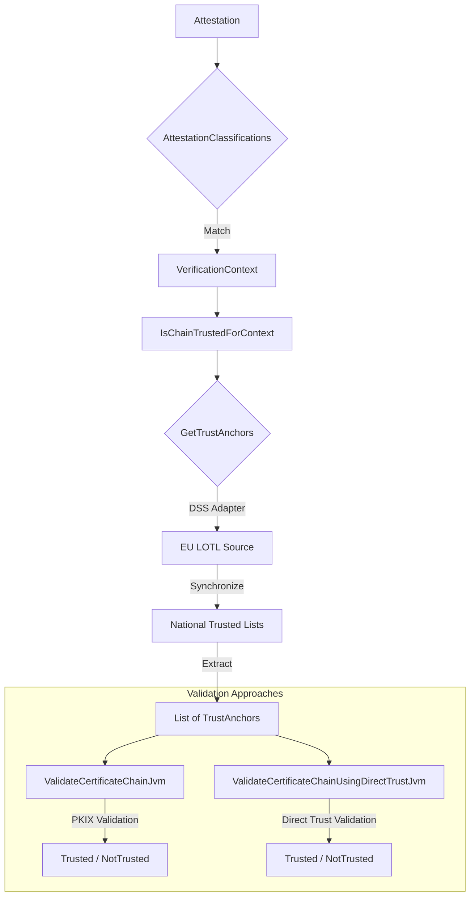

# DSS Consultation Module

This module provides abstractions and implementations for validating certificate chains against trust anchors that are
published in [ETSI TS 119 612 Trusted Lists](https://www.etsi.org/deliver/etsi_ts/119600_119699/119612/02.04.01_60/ts_119612v020401p.pdf).

Trusted Lists are fetched, parsed, and validated using [Digital Signature Service (DSS)](https://github.com/esig/dss).

The module automates the process of fetching and verifying the
European List of Trusted Lists (LOTL).
It wraps the stateful DSS `TLValidationJob` into the library's functional `GetTrustAnchors` interface.

## Quick Start

### 1. Add dependency

To use this library, you have to add the following dependency to your project:

```kotlin
dependencies {
    implementation("eu.europa.ec.eudi:etsi-1196x2-consultation-dss:$version")
}
```

> [!NOTE]
>
> This library exposes **only** the classes of `eu.europa.ec.joinup.sd-dss:dss-tsl-validation` and its transitive dependencies as `api`.

> [!IMPORTANT]
>
> DSS abstracts certain utility APIs, and provides two implementations:
>
> * `dss-utils-apache-commons`: Implementation of dss-utils with Apache Commons libraries
> * `dss-utils-google-guava`: Implementation of dss-utils with Google Guava
>
> Users of this library must also include the DSS implementation of their choice.
>
> ```kotlin
> dependencies {
>     implementation("eu.europa.ec.joinup.sd-dss:dss-utils-apache-commons:$dssVersion")
>     // OR
>     implementation("eu.europa.ec.joinup.sd-dss:dss-utils-google-guava:$dssVersion")
> }
> ```

> [!IMPORTANT]
>
> DSS provides a JAXB-based XML implementation of a validation policy within the `eu.europa.ec.joinup.sd-dss:dss-policy-jaxb` module.
> To load this validation policy implementation, users must also include the following dependency:
>
> ```kotlin
> dependencies {
>     implementation("eu.europa.ec.joinup.sd-dss:dss-policy-jaxb:$dssVersion")
> }
> ```
>
> More information is available [here](https://github.com/esig/dss/blob/master/dss-cookbook/src/main/asciidoc/_chapters/signature-validation.adoc#12-ades-validation-constraintspolicy).

### 2. Setup and Use

```kotlin
// 1. Setup DSS options with a 24-hour file cache, and get an instance of GetTrustAnchorsFromLoTL
val getTrustAnchorsFromLoTL = GetTrustAnchorsFromLoTL(
    dssOptions = DssOptions.usingFileCacheDataLoader(
        fileCacheExpiration = 24.hours,
        cacheDirectory = createTempDirectory("lotl-cache"),
    )
)

// 2. Define one or more LOTL Source (DSS class)
val pidLotl = LOTLSource().apply {
    url = "https://example.com/LOTL.xml"
    // ... further configuration (predicates, etc.)
}
val pubEAALotl = LOTLSource().apply { }

// 3. Create IsChainTrustedForContext instances for each context
val pidValidator = IsChainTrustedForContext(
    supportedContexts = setOf(VerificationContext.PID),
    getTrustAnchors = getTrustAnchorsFromLoTL.transform(mapOf(VerificationContext.PID to pidLotl)),
    validateCertificateChain = ValidateCertificateChainJvm()
)

val pubEAAValidator = IsChainTrustedForContext(
    supportedContexts = setOf(VerificationContext.PubEAA),
    getTrustAnchors = getTrustAnchorsFromLoTL.transform(mapOf(VerificationContext.PubEAA to pubEAALotl)),
    validateCertificateChain = ValidateCertificateChainJvm()
)

// 4. Combine validators using ComposeChainTrust
val trustValidator = ComposeChainTrust.of(pidValidator, pubEAAValidator)

// 5. Instantiate the final validator
val isTrusted = IsChainTrustedForEUDIW(trustValidator)

// 6. Use it
val result = isTrusted(chain, VerificationContext.PID)
```

### Examples

Usage examples can be found in:

* [IsChainTrustedUsingLoTLTest.kt](src/jvmAndAndroidTest/kotlin/eu/europa/ec/eudi/etsi1196x2/consultation/dss/IsChainTrustedUsingLoTLTest.kt)

## Architecture Overview



The DSS module supports both validation strategies:
- **PKIX-based validation**: Traditional certificate chain validation using cryptographic PKIX algorithms
- **Direct-trust validation**: Direct certificate matching where the head certificate is compared against trust anchors by subject and serial number

## Multi-Tier Caching Strategy

The library implements a robust three-tier caching strategy to ensure the Wallet remains performant and offline-capable:

1.  **In-Memory** (`AsyncCache`): Results are cached in RAM (e.g., for 10 minutes) to handle concurrent validation requests without re-parsing.
2.  **File System** (`FileCacheDataLoader`): Persists the LOTL/TL data on the device (e.g., for 24 hours), enabling offline validation.
3.  **Source of Truth**: The official European Commission remote URL (or any other LOTL provider), fetched only when the file cache expires.

## DssOptions

`DssOptions` allow you to configure the DSS-based trust anchor retrieval:

- `loader`: The DSS `DSSCacheFileLoader` to use (defaults to `FileCacheDataLoader`).
- `cleanMemory`: Whether to clean the memory cache of DSS (default: `true`).
- `cleanFileSystem`: Whether to clean the file system cache of DSS (default: `true`).
- `synchronizationStrategy`: The strategy for LOTL/TL synchronization (default: `ExpirationAndSignatureCheckStrategy` which rejects expired/invalid lists).

You can easily create `DssOptions` with a file cache using:
```kotlin
DssOptions.usingFileCacheDataLoader(
    fileCacheExpiration = 24.hours,
    cacheDirectory = Paths.get(cachePath)
)
```

## High-Concurrency Scenarios

In applications with many concurrent certificate validation requests (e.g., server-side validation, high-throughput wallets), optimizing cache efficiency becomes critical.

### Three-Layer Cache Architecture

When using `ConcurrentCacheDataLoader` with a cached `GetTrustAnchorsFromLoTL`, you get three complementary cache layers:

```
┌─────────────────────────────────────────────────────────────────┐
│ Layer 1: AsyncCache (GetTrustAnchorsFromLoTL)                  │
│ - Deduplicates concurrent queries using LOTLSource as key      │
│ - TTL-based in-memory cache                                    │
│ - Prevents redundant LOTL/TL lookups for same query            │
└─────────────────────────────────────────────────────────────────┘
                              ↓
┌─────────────────────────────────────────────────────────────────┐
│ Layer 2: ConcurrentCacheDataLoader - In-Memory                 │
│ - Per-URL HTTP response cache                                  │
│ - Deduplicates concurrent HTTP requests for same URL           │
│ - Prevents multiple downloads of same LOTL/TL file             │
└─────────────────────────────────────────────────────────────────┘
                              ↓
┌─────────────────────────────────────────────────────────────────┐
│ Layer 3: ConcurrentCacheDataLoader - File System               │
│ - Persistent cache with configurable expiration                │
│ - Per-URL mutex prevents concurrent file corruption            │
│ - Atomic writes ensure cache integrity                         │
│ - Enables offline validation                                   │
└─────────────────────────────────────────────────────────────────┘
```

### Example: High-Concurrency Setup

```kotlin
import eu.europa.ec.eudi.etsi1196x2.consultation.cached
import eu.europa.ec.eudi.etsi1196x2.consultation.dss.ConcurrentCacheDataLoader
import kotlinx.coroutines.*
import kotlin.time.Duration.Companion.hours
import kotlin.time.Duration.Companion.minutes

// 1. Create thread-safe loader with dual-layer caching
val loader = ConcurrentCacheDataLoader(
    httpLoader = NativeHTTPDataLoader(),
    fileCacheExpiration = 24.hours,
    cacheDirectory = Paths.get("/cache/lotl"),
)

// 2. Configure DSS with the concurrent-safe loader
val dssOptions = DssOptions(loader = loader)

// 3. Create GetTrustAnchorsFromLoTL
val getTrustAnchorsFromLoTL = GetTrustAnchorsFromLoTL(dssOptions)

// 4. Wrap with AsyncCache for additional deduplication
//    This reduces concurrent LOTLSource queries at the application level
//    Both loader and cachedGetTrustAnchors are AutoCloseable
loader.use {
    getTrustAnchorsFromLoTL.cached(
        ttl = 10.minutes,
        expectedQueries = 100,  // Expected concurrent queries
    ).use { cachedGetTrustAnchors ->
        // 5. Handle concurrent validation requests efficiently
        runBlocking {
            (1..100).map { i ->
                async {
                    val trustAnchors = cachedGetTrustAnchors(loTLSource)
                    // Validate certificate chain...
                }
            }.awaitAll()
        }
    }
}
```

### Benefits

With this three-layer approach:

- **Layer 1** deduplicates concurrent queries to unique LOTLSource lookups
- **Layer 2** deduplicates concurrent HTTP requests to minimal remote fetches
- **Layer 3** serves cached files after initial download, enabling offline validation

> [!NOTE]
>
> `ConcurrentCacheDataLoader` uses the system clock for file cache expiration to ensure consistency with filesystem timestamps.
>
> `AsyncCache` can use a custom clock for testing purposes.

### When to Use

**Recommended for:**
- ✅ Server-side validation with concurrent user requests
- ✅ High-throughput wallets processing multiple attestations
- ✅ Applications with parallel validation pipelines

**Not required for:**
- ✅ Single-threaded or low-concurrency applications
- ✅ Simple client-side validation with sequential requests
- ✅ Testing environments with controlled timing

## Platform Support

The library targets JVM and Android.