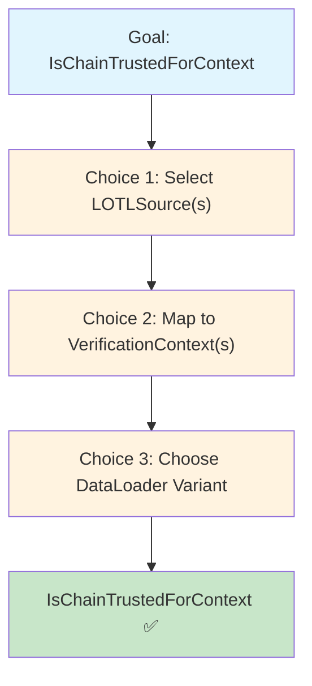
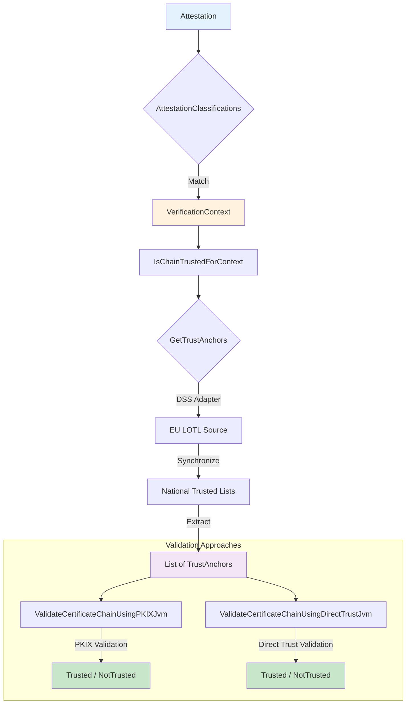
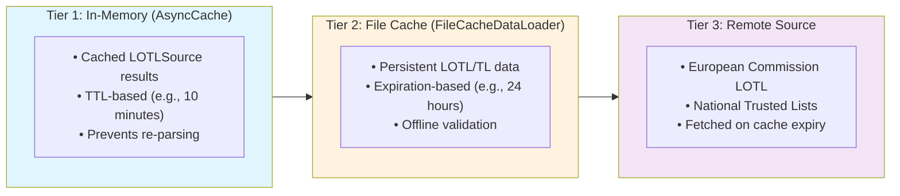
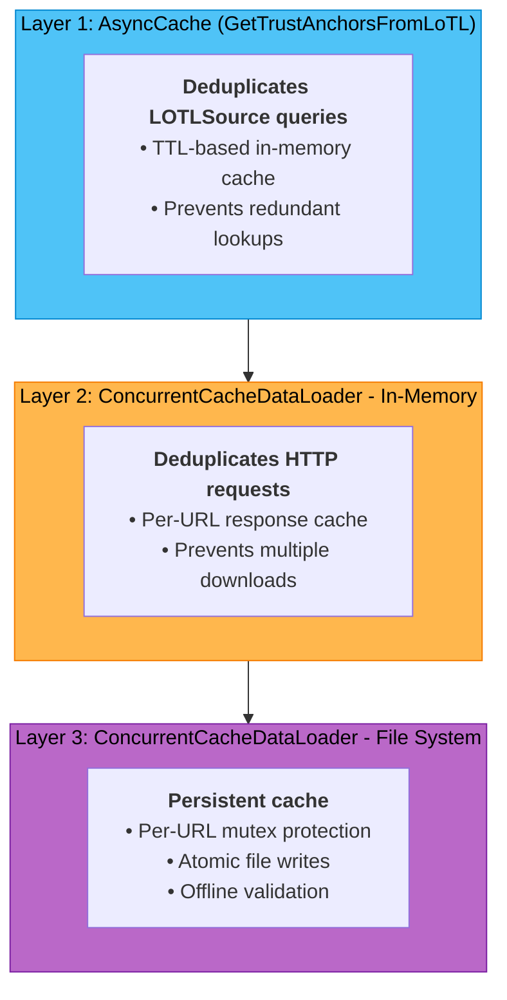

# DSS Consultation Module

This module provides abstractions and implementations for validating certificate chains against trust anchors that are published in [ETSI TS 119 612 Trusted Lists](https://www.etsi.org/deliver/etsi_ts/119600_119699/119612/02.04.01_60/ts_119612v020401p.pdf).

Trusted Lists are fetched, parsed, and validated using [Digital Signature Service (DSS)](https://github.com/esig/dss). The module automates the process of fetching and verifying the European List of Trusted Lists (LOTL) and wraps the stateful DSS `TLValidationJob` into the library's functional `GetTrustAnchors` interface.

**The ultimate goal is to create an instance of `IsChainTrustedForContext`** to validate certificate chains against trust anchors from ETSI Trusted Lists. To achieve this, you need to make three key decisions:

1. **Select LOTLSource(s)** - Which trusted lists to use
2. **Map to VerificationContext(s)** - How to associate trust sources with use cases
3. **Choose DataLoader variant** - Standard or high-concurrency caching

---

## Quick Start

Here's the minimal path to `IsChainTrustedForContext`:

```kotlin
import eu.europa.ec.eudi.etsi1196x2.consultation.dss.*
import eu.europa.ec.eudi.etsi1196x2.consultation.IsChainTrustedForContext
import eu.europa.ec.eudi.etsi1196x2.consultation.VerificationContext
import eu.europa.ec.eudi.etsi1196x2.consultation.ValidateCertificateChainUsingPKIXJvm
import kotlin.time.Duration.Companion.hours

// 1. Define your LOTL Source
val lotlSource = LOTLSource().apply {
    url = "https://ec.europa.eu/tools/lotl/eu-lotl.xml"
    // Configure predicates to filter trust anchors for your use case
}

// 2. Create GetTrustAnchorsFromLoTL with standard file cache
// Note: usingFileCacheDataLoader() is suitable for low-concurrency use cases
// like mobile EUDIW wallets or desktop applications
val getTrustAnchors = GetTrustAnchorsFromLoTL(
    dssOptions = DssOptions.usingFileCacheDataLoader(
        fileCacheExpiration = 24.hours,
        cacheDirectory = createTempDirectory("lotl-cache"),
    )
)

// 3. Map LOTLSource to VerificationContext and create validator
val isChainTrustedForContext = IsChainTrustedForContext(
    supportedContexts = setOf(VerificationContext.PID),
    getTrustAnchors = getTrustAnchors.transform(mapOf(VerificationContext.PID to lotlSource)),
    validateCertificateChain = ValidateCertificateChainUsingPKIXJvm.Default
)

// 4. Use it
val result = isChainTrustedForContext(certificateChain, VerificationContext.PID)
```

> [!NOTE]
>
> This quick start uses `DssOptions.usingFileCacheDataLoader()` which is suitable for **low-concurrency scenarios** (e.g., mobile EUDIW wallets, desktop applications). For **high-concurrency scenarios** (e.g., server-side validation, high-throughput wallets), see [Choice 3: Choose DataLoader Variant](#choice-3-choose-dataloader-variant).

---

## Understanding Your Choices

To create an `IsChainTrustedForContext`, you need to make three key decisions:



### Choice 1: Select LOTLSource(s)

A `LOTLSource` defines which List of Trusted Lists to fetch and how to filter it.

| Scenario | Configuration |
|----------|---------------|
| **Single source** | One `LOTLSource` (e.g., EU LOTL only) |
| **Multiple sources** | Multiple `LOTLSource` instances (e.g., EU LOTL + national LOTL) |

```kotlin
val euLotl = LOTLSource().apply {
    url = "https://ec.europa.eu/tools/lotl/eu-lotl.xml"
    // Configure predicates...
}

val nationalLotl = LOTLSource().apply {
    url = "https://example.com/national-lotl.xml"
    // Configure predicates...
}
```

---

### Choice 2: Map to VerificationContext(s)

Map each `LOTLSource` to one or more `VerificationContext` values (e.g., `PID`, `PubEAA`, `mDL`).

| Scenario | Approach |
|----------|----------|
| **Single context** | Direct `transform()` with one context |
| **Multiple contexts** | Use `ComposeChainTrust` to combine validators |

**Single Context:**
```kotlin
val validator = IsChainTrustedForContext(
    supportedContexts = setOf(VerificationContext.PID),
    getTrustAnchors = getTrustAnchors.transform(
        mapOf(VerificationContext.PID to lotlSource)
    ),
    validateCertificateChain = ValidateCertificateChainUsingPKIXJvm.Default
)
```

**Multiple Contexts:**
```kotlin
// Create separate validators for each context
val pidValidator = IsChainTrustedForContext(
    supportedContexts = setOf(VerificationContext.PID),
    getTrustAnchors = getTrustAnchors.transform(
        mapOf(VerificationContext.PID to pidLotlSource)
    ),
    validateCertificateChain = ValidateCertificateChainUsingPKIXJvm.Default
)

val pubEAAValidator = IsChainTrustedForContext(
    supportedContexts = setOf(VerificationContext.PubEAA),
    getTrustAnchors = getTrustAnchors.transform(
        mapOf(VerificationContext.PubEAA to pubEaaLotlSource)
    ),
    validateCertificateChain = ValidateCertificateChainUsingPKIXJvm.Default
)

// Combine them
val trustValidator = ComposeChainTrust.of(pidValidator, pubEAAValidator)
val isTrusted = IsChainTrustedForEUDIW(trustValidator)
```

---

### Choice 3: Choose DataLoader Variant

The DataLoader determines how trust lists are fetched and cached.

| Use Case | DataLoader | Characteristics |
|----------|------------|-----------------|
| **Low-concurrency**<br>(mobile, desktop) | `usingFileCacheDataLoader()`<br>(DSS default) | • Simple setup<br>• File-based caching<br>• Suitable for sequential requests |
| **High-concurrency**<br>(server, high-throughput) | `ConcurrentCacheDataLoader`<br>(custom implementation) | • Thread-safe<br>• Per-URL mutex protection<br>• Dual-layer caching<br>• Atomic file writes |

**Low-Concurrency (Mobile EUDIW):**
```kotlin
val getTrustAnchors = GetTrustAnchorsFromLoTL(
    dssOptions = DssOptions.usingFileCacheDataLoader(
        fileCacheExpiration = 24.hours,
        cacheDirectory = createTempDirectory("lotl-cache"),
    )
)
```

**High-Concurrency (Server-Side):**
```kotlin
import eu.europa.ec.eudi.etsi1196x2.consultation.cached

val loader = ConcurrentCacheDataLoader(
    httpLoader = NativeHTTPDataLoader(),
    fileCacheExpiration = 24.hours,
    cacheDirectory = Paths.get("/cache/lotl"),
)

val dssOptions = DssOptions(loader = loader)
val getTrustAnchors = GetTrustAnchorsFromLoTL(dssOptions)

// Use with resource management (implements AutoCloseable)
loader.use {
    // Optionally wrap with AsyncCache for additional deduplication
    getTrustAnchors.cached(
        ttl = 10.minutes,
        expectedQueries = 100,
    ).use { cachedGetTrustAnchors ->
        // Use cachedGetTrustAnchors for validation
    }
}
```

---

## Architecture Overview



The DSS module supports two validation strategies:

| Strategy | Description | Use Case |
|----------|-------------|----------|
| **PKIX-based validation** | Traditional certificate chain validation using cryptographic PKIX algorithms | Standard X.509 validation with CRL/OCSP |
| **Direct-trust validation** | Direct certificate matching where the head certificate is compared against trust anchors by subject and serial number | Simplified validation without revocation checking |

> [!NOTE]
>
> **For ETSI TS 119 612 Trusted Lists, PKIX-based validation is the standard approach.** ETSI TS 119 612 Annex I explicitly references IETF RFC 5280 (X.509/PKIX) for certificate path validation when using trust anchors from Trusted Lists. Direct-trust validation may be suitable for simpler scenarios but is not the primary method specified for EUDI Wallet use cases.

---

## Caching Strategies

### Standard Caching (Low-Concurrency)

When using `DssOptions.usingFileCacheDataLoader()`, you get a three-tier caching strategy:



**Suitable for:**
- ✅ Mobile EUDIW wallets
- ✅ Desktop applications
- ✅ Single-user scenarios
- ✅ Sequential validation requests

---

### High-Concurrency Caching

When using `ConcurrentCacheDataLoader` with `cached()`, you get enhanced three-layer caching:



**Key Features:**
- **Per-URL mutex:** Serializes file writes to prevent cache corruption
- **In-memory cache:** Deduplicates concurrent HTTP requests
- **Atomic file writes:** Write to temp file, then atomic move
- **System clock:** File expiration uses system clock (consistency with filesystem timestamps)

**Suitable for:**
- ✅ Server-side validation with concurrent user requests
- ✅ High-throughput wallets processing multiple attestations
- ✅ Applications with parallel validation pipelines

**Not required for:**
- ❌ Single-threaded or low-concurrency applications
- ❌ Simple client-side validation with sequential requests
- ❌ Testing environments with controlled timing

> [!NOTE]
>
> `ConcurrentCacheDataLoader` uses the **system clock** for file cache expiration to ensure consistency with filesystem timestamps. `AsyncCache` can use a custom clock for testing purposes.

---

## Complete Examples

### Example 1: Single Context, Low-Concurrency (Mobile Wallet)

```kotlin
import eu.europa.ec.eudi.etsi1196x2.consultation.dss.*
import eu.europa.ec.eudi.etsi1196x2.consultation.IsChainTrustedForContext
import eu.europa.ec.eudi.etsi1196x2.consultation.VerificationContext
import eu.europa.ec.eudi.etsi1196x2.consultation.ValidateCertificateChainUsingPKIXJvm
import kotlin.time.Duration.Companion.hours

// Define LOTL Source for PID
val pidLotl = LOTLSource().apply {
    url = "https://ec.europa.eu/tools/lotl/eu-lotl.xml"
    // Configure predicates to filter PID-issuing trust anchors
}

// Create GetTrustAnchorsFromLoTL with standard file cache
val getTrustAnchors = GetTrustAnchorsFromLoTL(
    dssOptions = DssOptions.usingFileCacheDataLoader(
        fileCacheExpiration = 24.hours,
        cacheDirectory = createTempDirectory("lotl-cache"),
    )
)

// Create validator for PID context
val isChainTrustedForPid = IsChainTrustedForContext(
    supportedContexts = setOf(VerificationContext.PID),
    getTrustAnchors = getTrustAnchors.transform(
        mapOf(VerificationContext.PID to pidLotl)
    ),
    validateCertificateChain = ValidateCertificateChainUsingPKIXJvm.Default
)

// Use it
val result = isChainTrustedForPid(certificateChain, VerificationContext.PID)
```

---

### Example 2: Multiple Contexts, Low-Concurrency (Mobile Wallet)

```kotlin
import eu.europa.ec.eudi.etsi1196x2.consultation.dss.*
import eu.europa.ec.eudi.etsi1196x2.consultation.*
import eu.europa.ec.eudi.etsi1196x2.consultation.ValidateCertificateChainUsingPKIXJvm
import kotlin.time.Duration.Companion.hours

// Define LOTL Sources for different contexts
val pidLotl = LOTLSource().apply {
    url = "https://ec.europa.eu/tools/lotl/eu-lotl.xml"
    // Configure for PID
}

val pubEaaLotl = LOTLSource().apply {
    url = "https://ec.europa.eu/tools/lotl/eu-lotl.xml"
    // Configure for PubEAA
}

// Create GetTrustAnchorsFromLoTL
val getTrustAnchors = GetTrustAnchorsFromLoTL(
    dssOptions = DssOptions.usingFileCacheDataLoader(
        fileCacheExpiration = 24.hours,
        cacheDirectory = createTempDirectory("lotl-cache"),
    )
)

// Create separate validators for each context
val pidValidator = IsChainTrustedForContext(
    supportedContexts = setOf(VerificationContext.PID),
    getTrustAnchors = getTrustAnchors.transform(
        mapOf(VerificationContext.PID to pidLotl)
    ),
    validateCertificateChain = ValidateCertificateChainUsingPKIXJvm.Default
)

val pubEAAValidator = IsChainTrustedForContext(
    supportedContexts = setOf(VerificationContext.PubEAA),
    getTrustAnchors = getTrustAnchors.transform(
        mapOf(VerificationContext.PubEAA to pubEaaLotl)
    ),
    validateCertificateChain = ValidateCertificateChainUsingPKIXJvm.Default
)

// Combine validators
val trustValidator = ComposeChainTrust.of(pidValidator, pubEAAValidator)
val isTrusted = IsChainTrustedForEUDIW(trustValidator)

// Use it
val pidResult = isTrusted(pidChain, VerificationContext.PID)
val pubEAAResult = isTrusted(pubEAAChain, VerificationContext.PubEAA)
```

---

### Example 3: High-Concurrency Setup (Server-Side)

```kotlin
import eu.europa.ec.eudi.etsi1196x2.consultation.cached
import eu.europa.ec.eudi.etsi1196x2.consultation.dss.*
import eu.europa.ec.eudi.etsi1196x2.consultation.*
import eu.europa.ec.eudi.etsi1196x2.consultation.ValidateCertificateChainUsingPKIXJvm
import kotlinx.coroutines.*
import kotlin.time.Duration.Companion.hours
import kotlin.time.Duration.Companion.minutes

// Define LOTL Source
val lotlSource = LOTLSource().apply {
    url = "https://ec.europa.eu/tools/lotl/eu-lotl.xml"
    // Configure predicates...
}

// 1. Create thread-safe loader with dual-layer caching
val loader = ConcurrentCacheDataLoader(
    httpLoader = NativeHTTPDataLoader(),
    fileCacheExpiration = 24.hours,
    cacheDirectory = Paths.get("/cache/lotl"),
)

// 2. Configure DSS with the concurrent-safe loader
val dssOptions = DssOptions(loader = loader)

// 3. Create GetTrustAnchorsFromLoTL
val getTrustAnchors = GetTrustAnchorsFromLoTL(dssOptions)

// 4. Wrap with AsyncCache for additional deduplication
//    Both loader and cachedGetTrustAnchors are AutoCloseable
loader.use {
    getTrustAnchors.cached(
        ttl = 10.minutes,
        expectedQueries = 100,  // Expected concurrent queries
    ).use { cachedGetTrustAnchors ->
        // 5. Create validator with cached GetTrustAnchors
        val isChainTrustedForContext = IsChainTrustedForContext(
            supportedContexts = setOf(VerificationContext.PID),
            getTrustAnchors = cachedGetTrustAnchors.transform(
                mapOf(VerificationContext.PID to lotlSource)
            ),
            validateCertificateChain = ValidateCertificateChainUsingPKIXJvm.Default
        )

        // 6. Handle concurrent validation requests efficiently
        runBlocking {
            (1..100).map { i ->
                async {
                    val result = isChainTrustedForContext(chain, VerificationContext.PID)
                    // Process result...
                }
            }.awaitAll()
        }
    }
}
```

---

## Configuration Reference

### DssOptions

| Property | Type | Default | Description |
|----------|------|---------|-------------|
| `loader` | `DSSCacheFileLoader` | `FileCacheDataLoader` | DataLoader implementation |
| `cleanMemory` | `Boolean` | `true` | Clean DSS memory cache |
| `cleanFileSystem` | `Boolean` | `true` | Clean DSS file system cache |
| `synchronizationStrategy` | `SynchronizationStrategy` | `ExpirationAndSignatureCheckStrategy` | LOTL/TL sync strategy |
| `executorService` | `ExecutorService?` | `null` | Executor for validation job |
| `validateJobDispatcher` | `CoroutineDispatcher` | `Dispatchers.IO` | Dispatcher for validation |

### Factory Methods

**`DssOptions.usingFileCacheDataLoader()`** - Low-concurrency setup:
```kotlin
DssOptions.usingFileCacheDataLoader(
    fileCacheExpiration = 24.hours,
    cacheDirectory = Paths.get(cachePath),
    cleanMemory = true,
    cleanFileSystem = true,
    httpLoader = NativeHTTPDataLoader(),
    synchronizationStrategy = ExpirationAndSignatureCheckStrategy(),
)
```

**`ConcurrentCacheDataLoader`** - High-concurrency setup:
```kotlin
ConcurrentCacheDataLoader(
    httpLoader = NativeHTTPDataLoader(),
    fileCacheExpiration = 24.hours,
    cacheDirectory = Paths.get("/cache/lotl"),
    cacheDispatcher = Dispatchers.IO,
    httpCacheTtl = 5.seconds,
    maxCacheSize = 100,
)
```

---

## Platform Support

| Platform | Status |
|----------|--------|
| **JVM** | ✅ Supported |
| **Android** | ✅ Supported (minSdk=26, targetSdk=34) |

---

## Examples

Additional usage examples can be found in:

- [IsChainTrustedUsingLoTLTest.kt](src/jvmAndAndroidTest/kotlin/eu/europa/ec/eudi/etsi1196x2/consultation/dss/IsChainTrustedUsingLoTLTest.kt) - Basic and concurrent scenarios
- [ConcurrentCacheDataLoader Test](src/jvmAndAndroidTest/kotlin/eu/europa/ec/eudi/etsi1196x2/consultation/dss/IsChainTrustedUsingLoTLTest.kt) - High-concurrency stress tests

---

## Dependencies

> [!IMPORTANT]
>
> **DSS Utils Required** - Choose one:
> ```kotlin
> implementation("eu.europa.ec.joinup.sd-dss:dss-utils-apache-commons:$dssVersion")
> // OR
> implementation("eu.europa.ec.joinup.sd-dss:dss-utils-google-guava:$dssVersion")
> ```

> [!IMPORTANT]
>
> **Validation Policy Required:**
> ```kotlin
> implementation("eu.europa.ec.joinup.sd-dss:dss-policy-jaxb:$dssVersion")
> ```
>
> More information is available [here](https://github.com/esig/dss/blob/master/dss-cookbook/src/main/asciidoc/_chapters/signature-validation.adoc#12-ades-validation-constraintspolicy).
