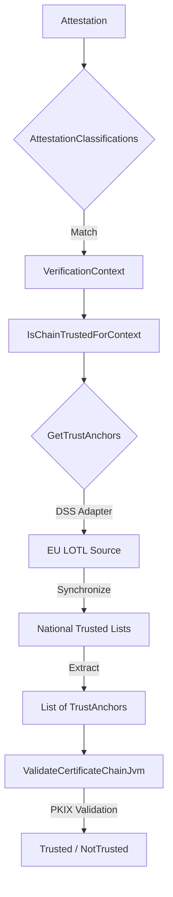

# DSS Consultation Module

This module provides abstractions and implementations for validating certificate chains against trust anchors that are
published in [ETSI TS 119 612 Trusted Lists](https://www.etsi.org/deliver/etsi_ts/119600_119699/119612/02.04.01_60/ts_119612v020401p.pdf).

Trusted Lists are fetched, parsed, and validated using [Digital Signature Service (DSS)](https://github.com/esig/dss).

The module automates the process of fetching and verifying the 
European List of Trusted Lists (LOTL). 
It wraps the stateful DSS `TLValidationJob` into the library's functional `GetTrustAnchors` interface.

## Quick Start

### 1. Add dependency

To use this library, you have to add the following dependency to your project:

```kotlin
dependencies {
    implementation("eu.europa.ec.eudi:etsi-1196x2-consultation-dss:$version")
}
```

> [!NOTE]
> 
> This library exposes **only** the classes of `eu.europa.ec.joinup.sd-dss:dss-tsl-validation` and its transitive dependencies as `api`.

> [!IMPORTANT]
> 
> DSS abstracts certain utility APIs, and provides two implementations:
> 
> * `dss-utils-apache-commons`: Implementation of dss-utils with Apache Commons libraries
> * `dss-utils-google-guava`: Implementation of dss-utils with Google Guava
> 
> Users of this library must also include the DSS implementation of their choice.
> 
> ```kotlin
> dependencies {
>     implementation("eu.europa.ec.joinup.sd-dss:dss-utils-apache-commons:$dssVersion")
>     // OR
>     implementation("eu.europa.ec.joinup.sd-dss:dss-utils-google-guava:$dssVersion")
> }
> ```

> [!IMPORTANT]
> 
> DSS provides a JAXB-based XML implementation of a validation policy within the `eu.europa.ec.joinup.sd-dss:dss-policy-jaxb` module.
> To load this validation policy implementation, users must also include the following dependency:
> 
> ```kotlin
> dependencies {
>     implementation("eu.europa.ec.joinup.sd-dss:dss-policy-jaxb:$dssVersion")
> }
> ```
> 
> More information is available [here](https://github.com/esig/dss/blob/master/dss-cookbook/src/main/asciidoc/_chapters/signature-validation.adoc#12-ades-validation-constraintspolicy).

### 2. Setup and Use

```kotlin
// 1. Setup DSS options with a 24-hour file cache, and get an instance of GetTrustAnchorsFromLoTL
val getTrustAnchorsFromLoTL = GetTrustAnchorsFromLoTL(
    dssOptions = DssOptions.usingFileCacheDataLoader(
        fileCacheExpiration = 24.hours,
        cacheDirectory = createTempDirectory("lotl-cache"),
    )
).cached(ttl = 10.minutes, expectedQueries = 2) // that's optional

// 2. Define one or more LOTL Source (DSS class)
val pidLotl = LOTLSource().apply {
    url = "https://example.com/LOTL.xml"
    // ... further configuration (predicates, etc.)
}
val pubEAALotl = LOTLSource().apply { }

// 4. Defines mappings to verification contexts
val trustSource = getTrustAnchorsFromLoTL.transform(buildMap{
    put(VerificationContext.PID, pidLotl)
    put(VerificationContext.PubEAA, pubEAALotl)
})

// 5. Instantiate the final validator
val isTrustedResource = IsChainTrustedForEUDIW(
    validateCertificateChain = ValidateCertificateChainJvm(),
    getTrustAnchorsByContext = trustSource
)

// 6. Use it (Not the use, for resource safety reasons)
val result = isTrustedResource.use { isTrusted ->
    isTrusted(chain, VerificationContext.PID)
}
```

### Examples

Usage examples can be found in:

* [IsChainTrustedUsingLoTLTest.kt](src/jvmAndAndroidTest/kotlin/eu/europa/ec/eudi/etsi1196x2/consultation/dss/IsChainTrustedUsingLoTLTest.kt)

## Architecture Overview



## Multi-Tier Caching Strategy

The library implements a robust three-tier caching strategy to ensure the Wallet remains performant and offline-capable:

1.  **In-Memory** (`AsyncCache`): Results are cached in RAM (e.g., for 10 minutes) to handle concurrent validation requests without re-parsing.
2.  **File System** (`FileCacheDataLoader`): Persists the LOTL/TL data on the device (e.g., for 24 hours), enabling offline validation.
3.  **Source of Truth**: The official European Commission remote URL (or any other LOTL provider), fetched only when the file cache expires.

## DssOptions

`DssOptions` allow you to configure the DSS-based trust anchor retrieval:

- `loader`: The DSS `DSSCacheFileLoader` to use (defaults to `FileCacheDataLoader`).
- `cleanMemory`: Whether to clean the memory cache of DSS (default: `true`).
- `cleanFileSystem`: Whether to clean the file system cache of DSS (default: `true`).
- `synchronizationStrategy`: The strategy for LOTL/TL synchronization (default: `ExpirationAndSignatureCheckStrategy` which rejects expired/invalid lists).

You can easily create `DssOptions` with a file cache using:
```kotlin
DssOptions.usingFileCacheDataLoader(
    fileCacheExpiration = 24.hours,
    cacheDirectory = Paths.get(cachePath)
)
```

## Platform Support

The library targets JVM and Android.

