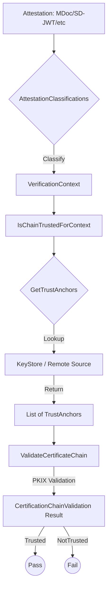

# Consultation Module

The EUDI ETSI 119 6x2 Consultation module 
is a Kotlin implementation designed for the European Digital Identity (EUDI) Wallet ecosystem. 
Its purpose is to provide an extensible and secure framework for Certificate Chain Validation against dynamic Trust Anchors.

The module enables Wallets, Issuers, and Verifiers 
to verify the trustworthiness of credentials (PIDs, EAAs) 
and attestation objects (WIA, WUA) by navigating trust trees within 
the European Union's identity framework.

## Quick Start

### 1. Add dependency

Add the following to your `build.gradle.kts`:

```kotlin
dependencies {
    implementation("eu.europa.ec.eudi:etsi-1196x2-consultation:$version")
}
```

### 2. Configure Attestation Classifications

Define how different attestation types (MDoc, SD-JWT VC) map to your `VerificationContext`.

```kotlin
val classifications = AttestationClassifications(
    pids = AttestationIdentifierPredicate.mdocMatching(Regex(".*PID.*")),
    pubEAAs = AttestationIdentifierPredicate.sdJwtVcMatching(Regex(".*PublicEAA.*"))
)
```

### 3. Use the High-Level API

```kotlin
val isChainTrustedResource : IsChainTrustedForEUDIW // Implementation of IsChainTrustedForEUDIW

val result = isChainTrustedResource.use { isChainTrusted ->
  val validator = IsChainTrustedForAttestation(
    isChainTrustedForContext = isChainTrusted, // Implementation of IsChainTrustedForEUDIW
    classifications = classifications
  )
  validator.issuance(chain, MDoc("eu.europa.ec.eudi.pid.1"))
}
```

## Core abstractions

The library separates the discovery of trust from the execution of validation logic using 
a high-level functional approach.

🛡️ **Validation & Context**

- `VerificationContext`: A sealed hierarchy representing specific EUDI use cases.
  - `PID`, `PubEAA`, `QEAA`: For credentials.
  - `WalletInstanceAttestation`, `WalletUnitAttestation`: For wallet-specific attestations.
  - `WalletRelyingPartyRegistrationCertificate`: For Verifier/Issuer certificates.
- `ValidateCertificateChain`: A functional abstraction of an engine that performs cryptographic PKIX validation of an X.509 chain against trust anchors.
- `IsChainTrustedForEUDIW`: The high-level orchestrator that resolves the correct trust anchors for a given context and triggers the validation engine.

🔍 **Trust Discovery**

- `GetTrustAnchors`: A functional interface for retrieving anchors based on a query (e.g., a Regex or a Context).
- `GetTrustAnchorsForSupportedQueries`: A router that ensures queries are directed only to sources explicitly configured to handle them.

🏷️ **Attestation Classification**
- `AttestationIdentifier`: Support for both ISO/IEC 18013-5 (MDoc), SD-JWT VC or other formats.
- `AttestationClassifications`: A predicate-based system that maps raw credential types to their required security levels and trust roots.

## Architecture Overview

The following diagram illustrates how a raw attestation moves through the library to reach a trust decision


## Implementation Choices

🧩 **Functional & Declarative Architecture**

The library favors Functional Interfaces and Composition over complex inheritance. 
Patterns like `contraMap` allow developers to adapt query dialects, while the `or` and `plus` operators enable 
the seamless merging of multiple trust sources.

🚀 **Non-Blocking & Coroutine Native**

Designed from the ground up for asynchronous environments (KMP):
- `suspend` everywhere: All I/O-bound and CPU-intensive tasks are suspendable.
- **Structured Concurrency**: Uses `SupervisorJob` and explicit `CoroutineDispatchers` to ensure stability.
- **Concurrency Guarding**: Features an `AsyncCache` to prevent redundant computations and "cache stampedes".

## Platform Support

The consultation module is a **Kotlin Multiplatform (KMP)** module.
- **commonMain**: Core logic and abstractions.
- **jvmAndAndroidMain**: Specific implementations for JVM and Android (e.g., `ValidateCertificateChainJvm`).


## Examples

### Combing trust anchors from multiple sources

```kotlin
// 1. Define your specific trust fetchers
val nationalIdFetcher = GetTrustAnchors { query -> 
    // Logic to fetch anchors from a local Secure Element or Government LOTL
    loadGovernmentRoots() 
}

val universityFetcher = GetTrustAnchors { query -> 
    // Logic to fetch anchors from a Sector-Specific University Trust List
    loadEducationRoots()
}

// 2 Create the routers
val nationalRouter = GetTrustAnchorsForSupportedQueries(
  supportedQueries = setOf(VerificationContext.PID),
  getTrustAnchors = nationalIdFetcher
)

val universityRouter = GetTrustAnchorsForSupportedQueries(
  supportedQueries = setOf(VerificationContext.EAA("UniversityDiploma")),
    getTrustAnchors = universityFetcher
)

// 3. Combine the routers
val trustRouter = nationalRouter + universityRouter

// 4. Usage in the validation engine
val pidIssuanceTrustAnchors = trustRouter(VerificationContext.PID)
```
