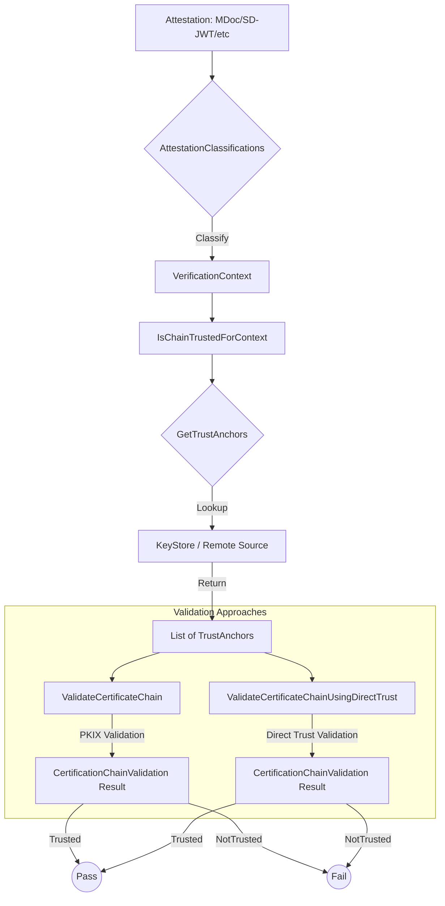

# Consultation Module

The EUDI ETSI 119 6x2 Consultation module
is a Kotlin implementation designed for the European Digital Identity (EUDI) Wallet ecosystem.
Its purpose is to provide an extensible and secure framework for Certificate Chain Validation against dynamic Trust Anchors.

The module enables Wallets, Issuers, and Verifiers
to verify the trustworthiness of credentials (PIDs, EAAs)
and attestation objects (WIA, WUA) by navigating trust trees within
the European Union's identity framework.

## Quick Start

### 1. Add dependency

Add the following to your `build.gradle.kts`:

```kotlin
dependencies {
    implementation("eu.europa.ec.eudi:etsi-1196x2-consultation:$version")
}
```

### 2. Configure Attestation Classifications

Define how different attestation types (MDoc, SD-JWT VC) map to your `VerificationContext`.

```kotlin
val classifications = AttestationClassifications(
    pids = AttestationIdentifierPredicate.mdocMatching(Regex(".*PID.*")),
    pubEAAs = AttestationIdentifierPredicate.sdJwtVcMatching(Regex(".*PublicEAA.*"))
)
```

### 3. Use the High-Level API

```kotlin
val isChainTrusted : IsChainTrustedForEUDIW // Implementation of IsChainTrustedForEUDIW

val isChainTrustedForAttestation = IsChainTrustedForAttestation(
    isChainTrustedForContext = isChainTrusted, // Implementation of IsChainTrustedForEUDIW
    classifications = classifications
)
val result = isChainTrustedForAttestation.issuance(chain, MDoc("eu.europa.ec.eudi.pid.1"))
```

## Core abstractions

The library separates the discovery of trust from the execution of validation logic using
a high-level functional approach.

🛡️ **Validation & Context**

- `VerificationContext`: A sealed hierarchy representing specific EUDI use cases.
  - `PID`, `PubEAA`, `QEAA`: For credentials.
  - `WalletInstanceAttestation`, `WalletUnitAttestation`: For wallet-specific attestations.
  - `WalletRelyingPartyRegistrationCertificate`: For Verifier/Issuer certificates.
- `ValidateCertificateChain`: A functional interface defining the contract for certificate chain validation, with two main implementations:
  - `ValidateCertificateChainUsingPKIX`: Performs traditional cryptographic PKIX validation (signature verification, path building, etc.)
  - `ValidateCertificateChainUsingDirectTrust`: Performs direct certificate matching by subject and serial number
- `IsChainTrustedForEUDIW`: The high-level orchestrator that resolves the correct trust anchors for a given context and triggers the validation engine.

🔍 **Trust Discovery**

- `GetTrustAnchors`: A functional interface for retrieving anchors based on a query (e.g., a Regex or a Context).
- `IsChainTrustedForContext`: The elementary aggregation unit that combines trust anchors and validation logic for a set of supported contexts.
- `AggegatedIsChainTrustedForContext`: A higher-level aggregator that combines multiple `IsChainTrustedForContext` instances.

🏷️ **Attestation Classification**
- `AttestationIdentifier`: Support for both ISO/IEC 18013-5 (MDoc), SD-JWT VC or other formats.
- `AttestationClassifications`: A predicate-based system that maps raw credential types to their required security levels and trust roots.

## Architecture Overview

The following diagram illustrates how a raw attestation moves through the library to reach a trust decision, supporting both PKIX-based and direct-trust validation approaches:



The library supports two validation strategies:
- **PKIX-based validation**: Traditional certificate chain validation using cryptographic PKIX algorithms
- **Direct-trust validation**: Direct certificate matching where the head certificate is compared against trust anchors by subject and serial number
## Implementation Choices

🧩 **Functional & Declarative Architecture**

The library favors Functional Interfaces and Composition over complex inheritance.
Patterns like `contraMap` allow developers to adapt query dialects, while the `or` and `plus` operators enable
the seamless merging of multiple trust sources.

🚀 **Non-Blocking & Coroutine Native**

Designed from the ground up for asynchronous environments (KMP):
- `suspend` everywhere: All I/O-bound and CPU-intensive tasks are suspendable.
- **Structured Concurrency**: Uses `SupervisorJob` and explicit `CoroutineDispatchers` to ensure stability.
- **Concurrency Guarding**: Features an `AsyncCache` to prevent redundant computations and "cache stampedes".

## Platform Support

The consultation module is a **Kotlin Multiplatform (KMP)** module.
- **commonMain**: Core logic and abstractions.
- **jvmAndAndroidMain**: Specific implementations for JVM and Android (e.g., `ValidateCertificateChainJvm`).


## Examples

### Combining trust anchors from multiple sources

```kotlin
// 1. Define your specific trust fetchers
val nationalIdFetcher = GetTrustAnchors { query ->
    // Logic to fetch anchors from a local Secure Element or Government LOTL
    loadGovernmentRoots()
}

val universityFetcher = GetTrustAnchors { query ->
    // Logic to fetch anchors from a Sector-Specific University Trust List
    loadEducationRoots()
}

// 2. Create IsChainTrustedForContext instances
val isChainTrustedForPID = IsChainTrustedForContext(
    supportedContexts = setOf(VerificationContext.PID),
    getTrustAnchors = nationalIdFetcher,
    validateCertificateChain = VerifyCertificateChainUsingDirectTrust()
)

val isChainTrustedForUniversityDiploma = IsChainTrustedForContext(
    supportedContexts = setOf(VerificationContext.EAA("UniversityDiploma")),
    getTrustAnchors = universityFetcher,
    validateCertificateChain = VerifyCertificateChainUsingDirectTrust()
)

// 3. Combine the validators using AggegatedIsChainTrustedForContext
val isChainTrusted = AggegatedIsChainTrustedForContext.of(isChainTrustedForPID, isChainTrustedForUniversityDiploma)

// 4. Usage in the validation engine
val pidIssuanceResult = isChainTrusted(chain, VerificationContext.PID)
```

### Using cached() for in-memory caching (AutoCloseable)

You can add transparent in-memory caching to any `GetTrustAnchors` source using the `cached()` decorator.

Important: The source returned by `cached()` is `AutoCloseable`. You must manage its lifecycle and call `close()` when it is no longer needed to release resources and stop background operations.

```kotlin

// 1. Define a base trust anchors source
// and decorate it with caching
val getTrustAnchors: GetTrustAnchors<VerificationContext, TrustAnchor> = GetTrustAnchors { ctx ->
    // Fetch anchors for the given context
    fetchAnchorsFor(ctx)
}.cached(
  ttl = 10.minutes,
  expectedQueries = 10
)

// 3. Use the cached source with IsChainTrustedForContext
cachedSource.use { caching ->
    val validator = IsChainTrustedForContext(
        supportedContexts = setOf(VerificationContext.PID),
        getTrustAnchors = caching,
        validateCertificateChain = ValidateCertificateChainJvm()
    )

    val isChainTrusted = IsChainTrustedForEUDIW(validator)
    val result = isChainTrusted(chain, VerificationContext.PID)
}
```

Notes:
- `cached()` prevents duplicate concurrent computations for the same query and refreshes entries after `ttl`.
- Failing to `close()` the cached source may keep background coroutines alive longer than needed and retain memory.
- Register the `AutoClosable` with a DI framework to ensure it is closed when no longer needed.