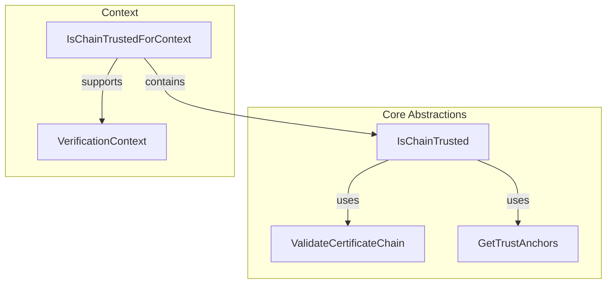

# Consultation Module

This module provides abstractions and implementations for validating certificate chains against trust anchors. 
It follows a layered approach, from high-level context-aware validation specific to EUDI Wallet 
to low-level chain validation.

## Key Components

### IsChainTrustedForContext

`IsChainTrustedForContext` is the high-level entry point for certificate chain validation. 
It acts as an aggregation of `IsChainTrusted` instances, organized per `VerificationContext`. 
It allows callers to validate a certificate chain within a specific functional context (e.g., verifying a PID or a Wallet Instance Attestation).

### VerificationContext

`VerificationContext` defines the various scenarios where certificate validation is required. Each context represents a specific use case, such as:
- `WalletInstanceAttestation`
- `WalletUnitAttestation`
- `PID`
- `PubEAA`
- and more.

### IsChainTrusted

`IsChainTrusted` is an abstraction that determines whether a certificate chain is trusted. 
It abstracts away the source from which trust anchors are retrieved via `GetTrustAnchors`.

The only way to obtain an instance of `IsChainTrusted` is to provide a `ValidateCertificateChain` 
and a `GetTrustAnchors` using the factory method `IsChainTrusted.Companion.invoke()`.

It coordinates the process by:

1. Retrieving trust anchors via `GetTrustAnchors`.
2. Delegating the actual validation to a `ValidateCertificateChain` implementation.

### GetTrustAnchors

`GetTrustAnchors` is a functional interface responsible for 
retrieving a list of trust anchors.

### ValidateCertificateChain

`ValidateCertificateChain` is a low-level abstraction responsible for the technical validation of a certificate chain. 
It assumes that a set of trust anchors is already provided and performs 
the necessary checks (signature verification, path validation, etc.) 
to determine if the chain is valid according to those anchors.

## Platform Support

The library provides specific implementations for JVM and Android targets:

- An implementation of `ValidateCertificateChain` based on the Java Security API.
- A factory method to obtain an `IsChainTrusted` instance from a `KeyStore`.

